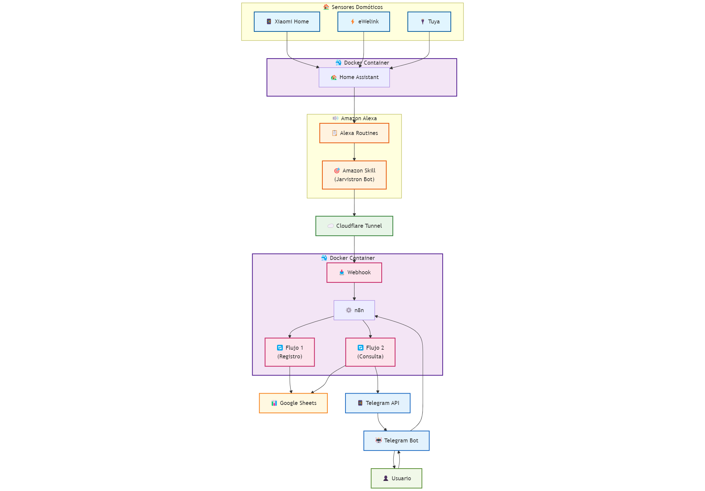

# Jarvistron Bot: Domótica y Alertas Inteligentes

Este proyecto personal, **Jarvistron Bot**, es una solución de domótica inteligente que integra **Amazon Alexa**, **Telegram**, **n8n** y **Google Sheets** para proporcionar monitoreo y alertas sobre la actividad del hogar. Nacido de la curiosidad y el deseo de aprender sobre la interconexión de sistemas, Jarvistron Bot demuestra cómo se pueden automatizar tareas y mejorar la seguridad en un entorno doméstico.

-----

## 🚀 ¿Cómo Funciona?

Jarvistron Bot orquesta varios componentes para crear un sistema cohesivo:

1.  **Amazon Alexa (Skill "Jarvistron Bot")**: Es el punto de entrada principal. A través de **rutinas de Alexa** configuradas en mi sistema de domótica, la skill envía información relevante sobre el estado de la casa.
2.  **Sensores Domóticos**: Sensores de **Xiaomi Home**, **eWelink** y **Tuya** (integrados a través de Home Assistant) activan las rutinas de Alexa, enviando datos sobre eventos como "puertas abiertas" o "movimiento detectado".
3.  **Home Assistant (Contenedor Docker)**: Actúa como el cerebro local de la domótica, recopilando datos de los diversos sensores y dispositivos.
4.  **n8n (Contenedor Docker)**: Este orquestador de flujos de trabajo maneja la lógica principal:
      * **Webhook para Google Sheets**: Recibe los datos de la skill de Alexa (vía Cloudflare Tunnel) y los registra automáticamente en una hoja de Google Sheets.
      * **Gestión del Bot de Telegram**: Envía mensajes de alerta a Telegram y permite consultar los registros de Google Sheets a través del bot.
5.  **Cloudflare Tunnels**: Proporciona una conexión segura y privada entre la Amazon Skill (y cualquier servicio externo) y los contenedores Docker de n8n y Home Assistant, sin exponer puertos directamente a internet.
6.  **Telegram Bot**: Un bot personalizado que envía **avisos instantáneos** sobre eventos críticos (ej., puertas abiertas, movimiento) directamente al móvil del usuario. También permite interactuar para consultar el historial de actividad.
7.  **Google Sheets**: Almacena un **historial detallado** y cronológico de todos los eventos de los sensores, facilitando el seguimiento y análisis para fines de seguridad.

-----

## 🌐 Arquitectura del Sistema

El siguiente diagrama ilustra el flujo de datos y la interacción entre los componentes clave de Jarvistron Bot:

-----

## ✨ Beneficios y Aprendizaje

Aunque su propósito principal ha sido el **aprendizaje práctico** en el campo de la automatización y la integración de sistemas, Jarvistron Bot ofrece beneficios concretos:

  * **Monitoreo Proactivo**: Alertas en tiempo real sobre la actividad en el hogar para una mayor tranquilidad.
  * **Registro Histórico**: Un historial completo de eventos para análisis y auditoría de seguridad.
  * **Integración Versátil**: Demuestra la capacidad de interconectar tecnologías dispares (voz, IoT, automatización low-code, contenedores, seguridad de red).
  * **Despliegue Robusto**: Uso de **Docker** para un despliegue eficiente y **Cloudflare Tunnels** para una conectividad segura y privada.

-----

## 🛠 Tecnologías Utilizadas

  * **Amazon Alexa Skills Kit**
  * **n8n** (Automatización y Workflows)
  * **Telegram Bot API**
  * **Google Sheets API**
  * **Home Assistant**
  * **Docker** (Contenerización)
  * **Cloudflare Tunnels** (Conectividad Segura)
  * Sensores **Xiaomi Home**, **eWelink**, **Tuya**

-----

## 📈 Próximos Pasos

Actualmente, estoy explorando la posibilidad de añadir capacidades de control remoto de la domótica directamente a través del bot de Telegram, lo que expandiría aún más la utilidad del sistema.

-----

## 🤝 Conéctate Conmigo

Este proyecto es un testimonio de cómo la curiosidad puede impulsar el aprendizaje y la creación de soluciones innovadoras. Si tienes preguntas, sugerencias o simplemente te gustaría discutir sobre domótica, automatización o integración de sistemas, ¡no dudes en contactarme\! en https://www.linkedin.com/in/yuryoropeza/

-----
